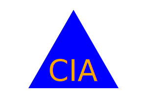

# Robot Design Department

## Description

CLI-based logo generation - design on the fly!

The primary motivation for building this CLI app was to practice relating files together with the FS module, as well as build tests in Jest. I had also prevously not worked with SVGs, and dynamically creating them, while simple in this context, can clearly be very powerful. 

## Demo

A demonstration of how to use this application can be found [here!!](https://drive.google.com/file/d/1eXoV4a6z79yqqhWUkW_8mhwJ1MYL50Xq/view?usp=sharing)

Here is an example logo created by the code:

## Table of Contents

- [Installation](#installation)
- [Usage](#usage)
- [License](#license)
- [Tests](#tests)
- [Questions](#questions)

## Installation

In order for the code to function properly from the command line, it will be important to install a few tools first:
- Node.js - [Documentation](https://nodejs.org/en/docs/)
- npm - [Documentation](https://docs.npmjs.com/)
- Jest - [Documentation](https://jestjs.io/docs/getting-started)

## Usage

Once the tools above are installed, the steps for running the program from the CLI are as follows:
1. From your CLI, initialize npm by running the command: "npm i"
2. Navigate to the root file of this directory, and run the index file: "node index.js"

Assuming the tools have been installed, the program should begin asking for input from the command line.

## License

MIT License

    Copyright (c) 2023
    
    Permission is hereby granted, free of charge, to any person obtaining a copy
    of this software and associated documentation files (the "Software"), to deal
    in the Software without restriction, including without limitation the rights
    to use, copy, modify, merge, publish, distribute, sublicense, and/or sell
    copies of the Software, and to permit persons to whom the Software is
    furnished to do so, subject to the following conditions:
    
    The above copyright notice and this permission notice shall be included in all
    copies or substantial portions of the Software.
    
    THE SOFTWARE IS PROVIDED "AS IS", WITHOUT WARRANTY OF ANY KIND, EXPRESS OR
    IMPLIED, INCLUDING BUT NOT LIMITED TO THE WARRANTIES OF MERCHANTABILITY,
    FITNESS FOR A PARTICULAR PURPOSE AND NONINFRINGEMENT. IN NO EVENT SHALL THE
    AUTHORS OR COPYRIGHT HOLDERS BE LIABLE FOR ANY CLAIM, DAMAGES OR OTHER
    LIABILITY, WHETHER IN AN ACTION OF CONTRACT, TORT OR OTHERWISE, ARISING FROM,
    OUT OF OR IN CONNECTION WITH THE SOFTWARE OR THE USE OR OTHER DEALINGS IN THE
    SOFTWARE.

## Tests

Because a great deal of the functionality is defined and not reliant on input, there was fairly little to test on the class constructors. For each shape, two test cases were created:
1. Does calling this class create an object?
2. Does this class properly extend the parent Shape class?

If you have installed Jest, you can run these tests from the CLI using the command "npm run test".

## Questions

valjean451 | [GitHub](https://github.com/valjean451)
Send any questions or comments to me directly at kendall.cluff@gmail.com. I promise to want to have time to answer them ;)